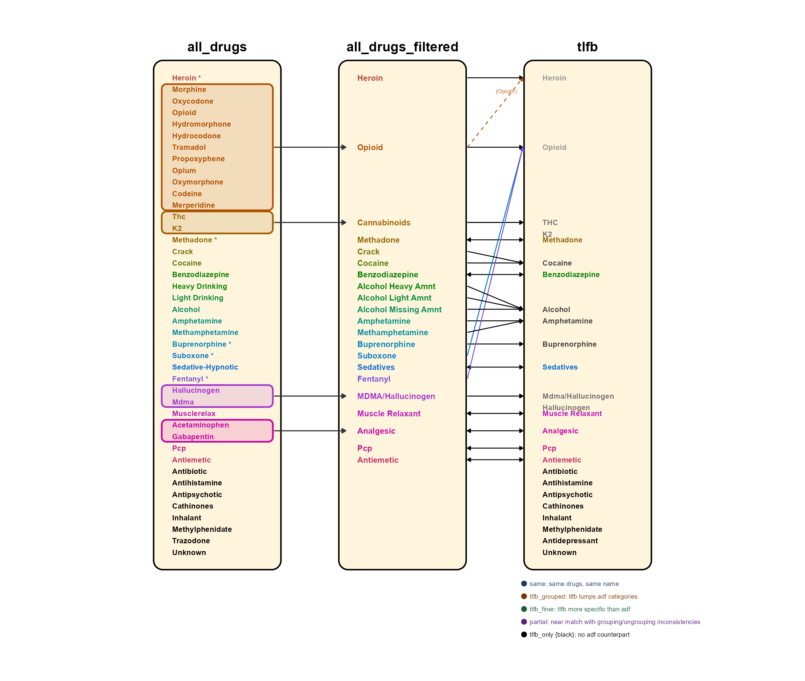

```{r load-packages}
library(conflicted)
suppressPackageStartupMessages(library(tidymodels))
tidymodels_prefer()
suppressPackageStartupMessages(library(tidyverse))
library(public.ctn0094data)
library(CTNote)
library(gtsummary)
library(knitr)
conflicts_prefer(dplyr::filter)
options(dplyr.summarise.inform = FALSE)
```

```{r build-analysis}
#| include: false
# source() runs the entire script in place — every object it creates (analysis_tibble,
# analysis_base, all_drugs_filtered, etc.) lands in this document's R environment.
# It's not like Python's `from module import x` (selective). It's closer to
# exec(open("building_analysis.py").read()) — the whole file runs here, and
# everything it touches becomes available below.
# #| include: false means this chunk runs silently: no code, no output in the
# rendered document.
source("building_analysis.R")
```

```{r logistic-regression}
#| include: false
# Same pattern as build-analysis: runs logistic_regression.R in place, making
# all fitted model objects available to the Results section below.
source("logistic_regression.R")
```

```{r logistic-regression-wopv}
#| include: false
#| cache-extra: !expr digest::digest(readLines("logistic_regression_without_problem_vars.R"))
# Sources the cleaned model (problem variables excluded). The guard inside the
# script skips rebuilding analysis_tibble since logistic_regression.R already
# created it. All _wopv objects land in this document's R environment.
source("logistic_regression_without_problem_vars.R")
```

```{r logistic-regression-wopv-kfold}
#| include: false
#| cache: true
#| cache-extra: !expr list(digest::digest(readLines("logistic_regression_wopv_kfold.R")), file.mtime("lr_kfold_rs.rds"))
source("logistic_regression_wopv_kfold.R")
```

```{r knn}
#| include: false
#| cache: true
#| cache-extra: !expr list(digest::digest(readLines("knn.R")), file.mtime("knn_tune.rds"), file.mtime("knn_vip.rds"))
source("knn.R")
```

```{r knn-save-metrics}
#| include: false
# knn_wopv.R overwrites kknn_tune / favorite / relapse_pred_knn.
# Read scalar AUCs from the named objects knn.R exported before that overwrite. # added 6/2
knn_train_auc <- knn_train_metrics$.estimate[knn_train_metrics$.metric == "roc_auc"]
knn_cv_auc    <- knn_cv_metrics$mean[knn_cv_metrics$.metric == "roc_auc"]
```

```{r knn-wopv}
#| include: false
#| cache: true
#| cache-extra: !expr list(digest::digest(readLines("knn_wopv.R")), file.mtime("knn_wopv_tune.rds"), file.mtime("knn_wopv_vip.rds"))
source("knn_wopv.R")
```

```{r logistic-enet}
#| include: false
#| cache: true
#| cache-extra: !expr list(digest::digest(readLines("logistic_enet.R")), file.mtime("enet_tune.rds"), file.mtime("lasso_tune.rds"))
source("logistic_enet.R")
```

```{r cart}
#| include: false
#| cache: true
#| cache-extra: !expr list(digest::digest(readLines("cart.R")), file.mtime("cart_tune.rds"))
source("cart.R")
```

```{r random-forest}
#| include: false
#| cache: true
#| cache-extra: !expr list(digest::digest(readLines("random_forest.R")), file.mtime("randfor_tune.rds"))
source("random_forest.R")
```

```{r xgboost}
#| include: false
#| cache: true
#| cache-extra: !expr list(digest::digest(readLines("xgboost.R")), file.mtime("xgboost_tune.rds"))
source("xgboost.R")
```

```{r tabpfn}
#| include: false
#| cache: true
#| cache-extra: !expr list(digest::digest(readLines("tabpfn.R")), file.mtime("tabpfn_cv.rds"), file.mtime("tabpfn_vip.rds"))
source("tabpfn.R")
```

```{r precompute-captions}
#| include: false
# Pre-compute captions that contain inline R calculations (commas inside
# paste0 break !expr YAML parsing when placed directly in chunk options). # added 6/2
cap_tbl_demographics <- paste0(
  "Baseline characteristics of the ",
  scales::comma(nrow(analysis_tibble)),
  " care-seeking adults with opioid use disorder in CTN-0027, CTN-0030",
  " and CTN-0051 (2006-2016), by study."
)
cap_tbl_drug <- paste0(
  "Substance-use categories observed in the 28 days before randomization",
  " (days -28 to -1) among the ",
  scales::comma(nrow(analysis_base)),
  " CTN-0027/0030/0051 participants (2006-2016).",
  " N users and percentage are relative to the analysis sample."
)
cap_fig_withdrawal <- paste0(
  "Pre-induction withdrawal severity among care-seeking adults with opioid",
  " use disorder in CTN-0027, CTN-0030 and CTN-0051 (2006-2016).",
  " Scores derive from COWS (CTN-0027/0030) or SOWS (CTN-0051) before",
  " each participant's first MOUD dose.",
  " 0 = None, 1 = Mild, 2 = Moderate, 3 = Severe.",
  " Participants with no pre-induction assessment are excluded (n = ",
  sum(is.na(analysis_tibble$withdrawal_pre_score)), " excluded)."
)
# cap_all_metrics retired — tbl-all-metrics now uses a static inline caption
# Read from named objects in knn_wopv.R (kknn_tune/favorite now = wopv versions). # added 6/2
knn_wopv_train_auc <- knn_wopv_train_metrics$.estimate[knn_wopv_train_metrics$.metric == "roc_auc"]
knn_wopv_cv_auc    <- knn_wopv_cv_metrics$mean[knn_wopv_cv_metrics$.metric == "roc_auc"]

cap_vip_glm    <- "Logistic-regression (glm engine) variable importance for predicting relapse among CTN-0027/0030/0051 participants (2006-2016), ranked by absolute z-statistic; problem variables excluded."
cap_vip_glmnet <- paste0(
  "LASSO (glmnet engine) variable importance: the ", nrow(lasso_coef),
  " predictors with non-zero coefficients at the selected penalty",
  " for relapse prediction among CTN-0027/0030/0051 participants (2006-2016)."
)
cap_vip_knn    <- "K-nearest-neighbors (kknn engine) permutation variable importance for relapse prediction among CTN-0027/0030/0051 participants (2006-2016): mean decrease in test ROC AUC when each predictor is shuffled (10 permutations)."
cap_vip_cart   <- "CART (rpart engine) variable importance for relapse prediction among CTN-0027/0030/0051 participants (2006-2016): native impurity-based importance, measured as the mean decrease in node impurity weighted by the number of training samples reaching each split."
cap_vip_randfor <- "Random forest (ranger engine) variable importance for relapse prediction among CTN-0027/0030/0051 participants (2006-2016): native impurity-based importance, the mean decrease in Gini impurity attributable to each predictor averaged across 1,000 trees."
cap_vip_xgboost <- "XGBoost (xgboost engine) variable importance for relapse prediction among CTN-0027/0030/0051 participants (2006-2016): native gain-based importance, the mean improvement in training loss contributed by each predictor across all splits where it is used."
cap_vip_tabpfn  <- "TabPFN (pretrained transformer) permutation variable importance for relapse prediction among CTN-0027/0030/0051 participants (2006-2016): mean decrease in test ROC AUC when each predictor is shuffled (1 permutation)."
```

# Abstract

This study uses data from three NIDA Clinical Trials Network studies (CTN-0027, CTN-0030, CTN-0051) to build a predictive model of treatment response in people with opioid use disorder (OUD). We construct a pre-treatment feature matrix from behavioral, substance use, demographic, and clinical data in the 28 days before randomization, and evaluate whether these features predict relapse during the treatment period.

# Introduction

Opioid use disorder is associated with substantial mortality, morbidity, and economic burden in the United States. Medications for OUD (MOUD) — including methadone, buprenorphine-naloxone, and extended-release naltrexone — are effective treatments, yet individual response varies considerably. Matching patients to the treatment most likely to benefit them remains a central challenge in addiction medicine.

The CTN-0094 harmonized dataset combines three randomized clinical trials comparing MOUD regimens in opioid-dependent adults [@ctn0027; @ctn0030; @ctn0051]. By pooling data across studies, we have sufficient sample size to examine whether pre-treatment characteristics predict treatment response. The goal of this analysis is to build and evaluate a feature matrix capturing the 28 days prior to randomization, which will serve as input to predictive models of relapse outcomes.

# Methods

## Subjects

Data come from three NIDA Clinical Trials Network studies harmonized in the `public.ctn0094data` R package: CTN-0027 (methadone vs. buprenorphine-naloxone), CTN-0030 (buprenorphine-naloxone only), and CTN-0051 (extended-release naltrexone vs. buprenorphine-naloxone). Eligibility criteria for all three trials required a DSM-IV diagnosis of opioid dependence, age ≥ 18 years, and provision of informed consent. Only participants' first randomization is included; the CTN-0030 re-randomization step is excluded. The analysis sample includes `r nrow(analysis_base) |> scales::comma()` care-seeking adults with opioid use disorder, drawn from `r n_distinct(analysis_base$project) |> xfun::n2w()` harmonized NIDA Clinical Trials Network studies (CTN-0027, CTN-0030 and CTN-0051) conducted between 2006 and 2016.

## Feature Engineering

Substance use features are derived from the `all_drugs` dataset, which captures concurrent TLFB self-report, urine drug screen (UDS), and UDS with alcohol biomarker (UDSAB) measurements across 42 distinct substance labels. This multi-source instrument is more complete than the standalone `tlfb` table and improves detection sensitivity for under-reported use. The feature window spans days −28 to −1 relative to the screening date—the closing day of TLFB data collection—providing exactly four of each weekday per participant with no overlap with the treatment period.

Drug categories were harmonized and filtered through five sequential decisions, depicted in @fig-drug-mapping:

1. **Sparsity filter.** Drug categories with fewer than 10 total event-days across all participants in the 28-day window were dropped. Eight categories were removed: antibiotic, antihistamine, antipsychotic, cathinones, inhalant, methylphenidate, antidepressant (trazodone and tricyclic antidepressant combined), and unknown substance.

2. **Pharmacologically distinct opioids retained as separate features.** Heroin, methadone, buprenorphine, suboxone, and fentanyl were each kept as independent categories rather than collapsed into a generic opioid group. These substances differ in route of administration, receptor pharmacology, potency, and clinical trajectory, and the addiction literature supports their distinct predictive signatures for treatment outcomes [@strang2020; @mattick2009; @mattick2014; @ciccarone2021]. Streak features are omitted for the three MOUD agents (methadone, buprenorphine, suboxone) because sustained consecutive use reflects medication adherence rather than compulsive escalation. Amphetamine and methamphetamine are likewise retained as separate features: methamphetamine carries substantially higher potency, neurotoxicity, and addiction liability, and the two stimulants have distinct sociodemographic and clinical profiles in opioid-dependent populations [@mcgregor2005].

3. **Sparse categories with shared pharmacological mechanisms combined.** THC and K2 (synthetic cannabinoid) were merged into a single Cannabinoids category, as both are full cannabinoid receptor agonists with convergent neurobiological and rewarding effects [@pertwee2008]. MDMA and hallucinogen were combined (MDMA/Hallucinogen) based on their shared predominantly serotonergic mechanism and similarly low prevalence in this population. Eleven prescription opioids—codeine, hydrocodone, hydromorphone, meperidine, morphine, nalbuphine, opium, oxycodone, oxymorphone, propoxyphene, and tramadol—were pooled into a single Opioid category representing prescription opioid misuse, consistent with the pharmacological-class framework in the opioid misuse literature [@vowles2015]. Sedative-hypnotics and barbiturates were merged (Sedatives) as CNS depressants sharing a GABA~A~ mechanism and behavioral cross-tolerance [@griffiths2005]. Acetaminophen and gabapentin were merged (Analgesic) based on their shared role as non-opioid adjunctive analgesics in OUD management [@evoy2017]; pooled event counts were required to clear the sparsity threshold.

4. **Alcohol quantity subcategories preserved.** The three alcohol amount categories—heavy, light, and missing-quantity—were retained as distinct features rather than collapsed to a single indicator. This structure preserves a clinically interpretable alcohol restraint composite (heavy drinking days minus light drinking days) and allows models to distinguish binge-predominant from moderate drinking patterns.

5. **Per-drug features.** For each of the 21 surviving drug categories, up to three features were computed: total days of detected use in the window (`_days`), a binary any-use indicator (`_binary`), and the longest consecutive-day streak (`_streak`) where clinically meaningful. Streak was omitted for MOUD agents and for non-addictive prescription categories (analgesic, antiemetic, muscle relaxant), where consecutive use denotes adherence rather than escalation.

```{r fig-drug-mapping}
#| label: fig-drug-mapping
#| fig-cap: "Drug feature aggregation and cross-instrument mapping for the CTN-0094 feature matrix. The left panel (*all_drugs*) enumerates 42 substance labels detected in the 28-day pre-randomization window of the multi-source `all_drugs` dataset (CTN study TLFB self-report, urine drug screen, and urine drug screen with alcohol biomarker). Colored entries survived the ≥10-event sparsity filter and map to one of 21 aggregated categories in the center panel (*all_drugs_filtered*); gray entries were removed by the filter. Highlight boxes and arrows in the left panel indicate the merging of multiple raw labels into a single aggregate category. The right panel (*tlfb*) shows the 25 substance labels in the independent TLFB instrument, colored by their relationship to the center-panel aggregated categories: vivid palette color = same name (bidirectional arrow); dark gray = TLFB consolidates multiple aggregated categories; medium gray = TLFB is more specific than the aggregated category; light gray = partial match with differing underlying composition; black = TLFB-only label with no aggregated counterpart. The dashed arrow from the aggregated Opioid category to TLFB Heroin reflects the classification of opium-containing substances under the heroin rubric in the TLFB instrument. Asterisks (*) denote opioids retained as individual feature categories rather than folded into the Opioid group."
#| out-width: "100%"

```

Additional feature domains cover demographics, addiction severity index subscores, nicotine dependence (Fagerström), psychiatric comorbidity, pain, quality of life, withdrawal severity, and prescribed medication adherence. Feature engineering is implemented in `building_analysis.R`.

## Statistical Methods

All models predict a binary relapse outcome from the pre-treatment feature matrix. Candidate models span interpretable baselines through high-capacity ensemble methods. Final model selection will be based on cross-validated area under the ROC curve (AUC-ROC).

All models share a single `recipes` preprocessing pipeline applied inside each `workflow`, so that resampling re-estimates every data-dependent step on the analysis fold only (no leakage). The recipe gives `who` an ID role; removes treatment-arm leakage variables (`treatment_arm` and its medication-type proxies) and zero-variance columns; handles missingness in two tiers — structural study-level missingness gets an explicit `step_indicate_na()` indicator before median/mode imputation, while sporadic item-level missingness is median/mode imputed without an indicator; scores ordered factors with `step_ordinalscore()` where equal spacing is defensible; standardizes all numeric predictors with `step_normalize()`; one-hot encodes unordered factors and uses polynomial contrasts for cigarettes-per-day; and finally drops predictors correlated above |r| = 0.90 with `step_corr()`.

::: {.callout-important title="NOTE TO SELF — REMOVE BEFORE SUBMISSION"}

**Metric-priority reasoning (settle before writing the Discussion):**

- **Model selection prioritizes AUC-ROC** — threshold-free, and the convention adopted here. AUC is *symmetric* in sensitivity and specificity, so it encodes no operating preference, and a sens/spec priority does **not** change which model is selected.

- **Specificity is the operating-point priority in this design.** With relapse coded as the positive class, specificity = correctly identifying the participants who will *not* relapse — i.e., **identifying people whose pre-treatment profile is genuinely promising for treatment**. The costly error to minimize is the false positive (flagging a true non-relapser as high-risk), so a specificity-favoring operating point is the defensible choice. *[Suggested cites — confirm fit before using: Vickers & Elkin (2006), "Decision curve analysis: a novel method for evaluating prediction models," Med Decis Making 26(6):565–574 — formalizes choosing the operating point by the FP:FN cost ratio (the direct support for cost-weighting toward specificity); Wynants et al. (2019), "Three myths about risk thresholds for prediction models," BMC Med 17:192 — thresholds should reflect error costs, not be arbitrary; Pepe (2003), The Statistical Evaluation of Medical Tests — foundational sens/spec reference. SUD domain context: Acion et al. (2017), "Use of a machine learning framework to predict substance use disorder treatment success," PLoS ONE 12(4):e0175383. CAVEAT: the SUD ML literature is split — some opioid-relapse/dropout models deliberately prioritize SENSITIVITY (don't-miss-a-relapser); be ready to justify the specificity choice against that.]*

- **Implementing the specificity priority:** AUC tuning is neutral, and the current sens/spec are reported at the **Youden-J cutoff, which weights sensitivity and specificity equally** — so neither step yet encodes this preference. To prioritize specificity, apply a cost function at the operating point: either (a) **re-tune** hyperparameters on a cost-sensitive objective (heavier; the thresholded objective can destabilize selection), or (b) **more cost-effectively, a post-hoc threshold shift** on the same AUC-selected model (cheap, no re-tuning). Prefer (b).

- Word-choice caveat: this is a *prognostic relapse-risk* model, not a *treatment-benefit* model (treatment arm was excluded), so keep causal "benefit of the drug" language out of the final claims.

:::

### Logistic Regression

Standard binary logistic regression models the log-odds of relapse as a linear combination of predictors. Used as the interpretable baseline. Estimated via maximum likelihood; no regularization. Implemented in `tidymodels` using the `glm` engine. Two variants are reported: the full-predictor baseline, and a "no problem variables" model that additionally removes predictors exhibiting complete separation (sparse drug-use indicators whose maximum-likelihood estimate does not exist). Because ordinary logistic regression has no tuning parameters, generalization is estimated by 5-fold cross-validation with `fit_resamples()`, optimizing for — and reporting — cross-validated ROC AUC.

### LASSO and Elastic Net

Penalized logistic regression was fitted with the `glmnet` engine. Two specifications are reported. The elastic-net model tunes both the penalty ($\lambda$) and the mixture (the L1/L2 blend) over a regular 50 × 5 grid via 5-fold cross-validation; the 5-fold cross-validated search selected `mixture = 0.25` (25% L1 / 75% L2 blend — predominantly ridge with a small LASSO component). The pure-LASSO model fixes `mixture = 1` and tunes the penalty alone over 50 log-spaced values. Both optimize ROC AUC, and the final penalty is chosen by the one-standard-error rule (`select_by_one_std_err`), which takes the most heavily penalized model whose CV ROC AUC is within one standard error of the best — favoring sparsity. The L1 penalty is the natural tool for the separation-prone predictors above: it shrinks unstable coefficients toward (elastic net) or exactly to zero (LASSO at the selected penalty).

### K-Nearest Neighbors

K-nearest-neighbors classification was fitted with the `kknn` engine on the standardized predictor matrix (normalization is essential, since KNN uses Euclidean distance). The number of neighbors was tuned over $k = 5, 10, \ldots, 50$ by 5-fold cross-validation optimizing ROC AUC, with the neighbor count chosen by the one-standard-error rule. KNN was run on the full predictor set (including the separation-prone variables): unlike unpenalized logistic regression it has no coefficients to diverge, so it tolerates those predictors directly.

### Classification and Regression Tree (CART)

A single decision tree was fitted with the `rpart` engine using the same shared preprocessing recipe as the other models. The tree is grown by recursive binary splitting, using the Gini impurity criterion. The cost-complexity pruning parameter ($\alpha$, `cost_complexity`) controls tree depth: larger $\alpha$ prunes more aggressively, yielding a shallower, simpler tree. Ten candidate values of `cost_complexity` were evaluated on a log-spaced grid from $10^{-10}$ to $10^{-1}$ using 5-fold cross-validation, optimizing ROC AUC. The final pruning parameter was selected by the one-standard-error rule (`select_by_one_std_err` with `desc(cost_complexity)`), which prefers the most aggressively pruned tree whose CV ROC AUC is within one standard error of the best — guarding against overfit. Variable importance is the native impurity-based measure: the mean decrease in node impurity (Gini) attributable to each predictor, weighted by the number of training samples that pass through each split.

### Random Forest

A random forest was fitted with the `ranger` engine using the same shared preprocessing recipe as the other models. The forest aggregates 1,000 unpruned classification trees, each grown on a bootstrap resample of the training data with a random subset of predictors considered at every split; the ensemble vote averages away the high variance of any single tree. Two hyperparameters were tuned: `mtry` (the number of predictors sampled at each split) and `min_n` (the minimum node size). Because `mtry` is bounded above by the post-recipe predictor count — and the recipe's `step_corr()` drops a data-dependent number of correlated columns that varies across folds — the upper bound was computed as the minimum post-recipe predictor count across all cross-validation analysis sets, guaranteeing no candidate value exceeds any fold's available predictors. Tuning used 5-fold cross-validation optimizing ROC AUC over a regular grid, then a refined grid (`mtry` 1–30, `min_n` 20–40). The number of trees was fixed rather than tuned: forest performance is monotone non-decreasing in the number of trees, so it is set high (1,000) for stable estimates rather than searched. Unlike the penalized and pruned models, the final hyperparameters were chosen by best CV AUC (`select_best`) rather than the one-standard-error rule, because `mtry` and `min_n` do not define a canonical "simpler model" ordering (lower `mtry` adds randomization while higher `min_n` prunes — they pull in different directions). Variable importance is the native impurity measure: the mean decrease in Gini impurity attributable to each predictor, averaged across all 1,000 trees, which is more stable than a single tree's importance. (`importance = 'impurity'` is requested at engine time because `ranger` does not compute importance by default.)

### Gradient-Boosted Trees (XGBoost)

A gradient-boosted tree ensemble was fitted with the `xgboost` engine using the same shared preprocessing recipe. Unlike the random forest's parallel, independent trees, boosting builds trees sequentially: each new tree is fitted to the residual errors of the accumulated ensemble, and its contribution is shrunk by a learning rate before being added. Five hyperparameters were tuned jointly: `learn_rate` (shrinkage per tree), `tree_depth` (per-tree complexity), `loss_reduction` (the minimum loss decrease `gamma` required to make a split), `mtry` (predictors sampled per tree, i.e. `colsample_bytree`), and `sample_size` (the row subsample fraction per tree). Because a five-dimensional regular grid is combinatorially prohibitive, candidates were drawn with a space-filling (Latin-hypercube) design that covers the hyperparameter volume efficiently. Search ranges were `learn_rate` $10^{-7}$–$10^{-1.5}$, `tree_depth` 2–5, `loss_reduction` $10^{-7}$–$10^{1}$ (log10 scale), `mtry` 10–90 predictors, and `sample_size` 0.5–0.9. The number of boosting rounds was not tuned as a sixth dimension: it was fixed at a high upper bound (5,000) with **early stopping** (training halts when validation log-loss fails to improve for 50 consecutive rounds), so each candidate uses as many trees as it needs and no more. Tuning used 5-fold cross-validation optimizing ROC AUC, with the final configuration chosen by best CV AUC (`select_best`); as with the random forest, there is no canonical regularization ordering across these five parameters that would justify the one-standard-error rule. Variable importance is the native gain measure: the mean improvement in training loss contributed by each predictor across all splits where it is used.

### TabPFN

TabPFN (Tabular Prior-Data Fitted Network) is a pretrained in-context learning transformer that treats the entire training set as context and produces posterior predictive probabilities for each query observation in a single forward pass — no gradient descent or weight updating occurs at inference time [@hollmann2023]. The model was pretrained on millions of synthetic tabular datasets drawn from a Bayesian prior over data-generating mechanisms, enabling it to generalize to new classification tasks without any task-specific tuning. Because there are no tuning hyperparameters, cross-validation here serves solely as a performance estimate: for each of 5 folds the recipe is prepped on the analysis rows, TabPFN stores the baked analysis observations as in-context memory, and predictions are generated for the held-out assessment rows. Fold-level ROC AUCs are averaged to produce the CV estimate. The Python `tabpfn` package is accessed from R via `reticulate` (`tabpfn-env` virtual environment). Because the training set (~1,869 rows) exceeds the model's nominal 1,000-sample CPU limit, `ignore_pretraining_limits = TRUE` suppresses the resulting error; `device = "cpu"` is set for reproducibility. Variable importance uses model-agnostic permutation importance (as for KNN): one predictor at a time is shuffled and the drop in test ROC AUC is recorded (`nsim = 1`). Cross-validation fold AUCs are cached to `tabpfn_cv.rds`; permutation importance results are cached to `tabpfn_vip.rds`.

## Software

Analyses were conducted in `r stringr::word(R.Version()$version.string, 1, 3)`. Data were preprocessed and visualized with the `tidyverse` (version `r packageVersion("tidyverse")`) [@tidyverse2019] and harmonized clinical-trial data were obtained from `public.ctn0094data` (version `r packageVersion("public.ctn0094data")`). Modeling used the tidymodels ecosystem (version `r packageVersion("tidymodels")`) [@R-tidymodels], including `recipes` for preprocessing, `parsnip` for model specification, `rsample` for resampling, `tune` for hyperparameter search, `yardstick` for metrics, and `workflows` to bind them together. Penalized logistic regression used the `glmnet` engine [@R-glmnet], k-nearest-neighbors used `kknn` [@R-kknn], decision trees used `rpart` [@R-rpart], random forests used `ranger` [@R-ranger], gradient boosting used `xgboost` [@R-xgboost], variable importance used `vip` [@R-vip], summary tables used `gtsummary` (version `r packageVersion("gtsummary")`) [@R-gtsummary], and TabPFN's Python implementation was accessed via `reticulate` (version `r packageVersion("reticulate")`).

# Results

## Participants

```{r participant-counts}
#| include: false
n_by_study <- analysis_base |>
  dplyr::count(project) |>
  dplyr::mutate(project = as.character(project))
get_n <- function(study) n_by_study$n[n_by_study$project == study]
```

After restricting to first randomizations, the analysis sample comprised `r nrow(analysis_base) |> scales::comma()` participants: `r get_n("CTN-0027") |> scales::comma()` from CTN-0027, `r get_n("CTN-0030") |> scales::comma()` from CTN-0030, and `r get_n("CTN-0051") |> scales::comma()` from CTN-0051.

## Participant Characteristics

```{r tbl-demographics}
#| tbl-cap: !expr cap_tbl_demographics

analysis_tibble |>
  select(project, age, is_male, race, is_hispanic,
         education, is_living_stable) |>
  mutate(
    is_male         = factor(is_male,         levels = c(1, 0), labels = c("Yes", "No")),
    is_hispanic     = factor(is_hispanic,     levels = c(1, 0), labels = c("Yes", "No")),
    is_living_stable = factor(is_living_stable, levels = c(1, 0), labels = c("Yes", "No"))
  ) |>
  tbl_summary(
    by = project,
    include = c(age, is_male, race, is_hispanic, education, is_living_stable),
    label = list(
      age              ~ "Age (years)",
      is_male          ~ "Male",
      race             ~ "Race",
      is_hispanic      ~ "Hispanic ethnicity",
      education        ~ "Education",
      is_living_stable ~ "Stable housing"
    ),
    missing = "no"
  ) |>
  modify_header(label = "") |>
  bold_labels()
```

## Drug Use in the Pre-Treatment Window

```{r tbl-drug-prevalence}
#| tbl-cap: !expr cap_tbl_drug

n_analysis <- nrow(analysis_base)

all_drugs_filtered |>
  semi_join(analysis_base, by = "who") |>
  distinct(who, what_grouped) |>
  group_by(what_grouped) |>
  summarize(n_users = n(), .groups = "drop") |>
  mutate(
    pct = round(n_users / n_analysis * 100, 1),
    what_grouped = as.character(what_grouped)
  ) |>
  arrange(desc(n_users)) |>
  kable(
    col.names = c("Substance category", "N users", "% of sample"),
    align = "lrr"
  )
```

## Predictor Distributions

```{r fig-withdrawal-severity}
#| fig-cap: !expr cap_fig_withdrawal
#| fig-width: 6.5
#| fig-height: 4.0

analysis_tibble |>
  filter(!is.na(withdrawal_pre_score)) |>
  mutate(
    severity = factor(
      withdrawal_pre_score,
      levels = 0:3,
      labels = c("None (0)", "Mild (1)", "Moderate (2)", "Severe (3)")
    ),
    project = as.character(project)
  ) |>
  count(project, severity) |>
  group_by(project) |>
  mutate(pct = n / sum(n) * 100) |>
  ggplot(aes(x = severity, y = pct, fill = project)) +  # enriched 6/2
  geom_col(position = "dodge", width = 0.7) +
  scale_fill_brewer(palette = "Set2") +
  labs(
    title    = "Pre-induction withdrawal severity by study",
    subtitle = "Percent of each study's participants at each COWS/SOWS severity level",
    x = "Pre-induction withdrawal severity",
    y = "Percentage of participants (%)",
    fill = "Study"
  ) +
  theme_minimal(base_size = 11) +
  theme(legend.position = "top")
```

## Feature Matrix

```{r feature-dimensions}
n_participants <- nrow(analysis_tibble)
n_features     <- ncol(analysis_tibble) - 2L   # subtract who and project
```

The analysis tibble contains **`r n_participants |> scales::comma()` participants** and **`r n_features` engineered feature columns** (excluding participant ID and study assignment), spanning substance-use history (per-drug days, binary use, longest streak), polydrug days, drug-use breadth, demographics, addiction severity (ASI), nicotine dependence (Fagerström), pain, psychiatric comorbidity, quality of life, housing stability, IV-use risk behavior, withdrawal severity, prescribed-medication adherence, study site, and cross-domain interactions. This matrix is shipped as the `analysis_tibble` dataset in the `ctn0094.oliven` package.

## Logistic Regression

```{r tbl-lr-or}
#| tbl-cap: "Logistic regression odds ratios (p < 0.05, sorted by effect size). Wald 95% confidence intervals."

lr_or_table |>
  kable(
    digits    = 3,
    col.names = c("Predictor", "Odds Ratio", "95% CI Low", "95% CI High", "p-value")
  )
```

```{r tbl-lr-metrics}
#| tbl-cap: "Logistic regression model performance. Training and test sets from a stratified 75/25 split."

bind_cols(
  lr_metrics      |> rename(Train = .estimate),
  lr_test_metrics |> select(Test = .estimate)
) |>
  mutate(.metric = c("Accuracy", "ROC AUC", "Sensitivity", "Specificity")) |>
  kable(
    digits    = 3,
    col.names = c("Metric", "Train", "Test")
  )
```

### Exclusion of Structurally Sparse Predictors

```{r wopv-ci-check}
#| include: false
wopv_ci_check <- lr_fit_wopv |>
  tidy(exponentiate = TRUE) |>
  mutate(
    conf.low    = exp(log(estimate) - 1.96 * std.error),
    conf.high   = exp(log(estimate) + 1.96 * std.error),
    log10_width = log10(conf.high / conf.low)
  ) |>
  filter(!is.na(estimate), term != "(Intercept)")

wopv_top3_ci <- wopv_ci_check |> slice_max(log10_width, n = 3)
```

A second logistic regression was fitted after excluding predictors identified as problematic on substantive or numerical grounds. Five predictors were excluded for leakage: `took_own_study_drug`, `took_other_study_drug`, `methadone_binary`, `buprenorphine_binary`, and `suboxone_binary` encode treatment arm assignment directly or by proxy, introducing post-randomization information into the pre-treatment predictor set.

The remaining exclusions addressed complete separation. Inspection of the baseline coefficient table revealed predictors with Wald confidence intervals spanning 25–90 orders of magnitude — the diagnostic signature of a non-existent maximum likelihood estimate. When a predictor nearly perfectly partitions the binary outcome, the log-likelihood has no finite maximum and the iteratively reweighted least squares optimizer terminates at an arbitrarily large value; the resulting point estimate is numerically meaningless regardless of its apparent plausibility. All such predictors were sparse drug-use indicators (analgesic, antiemetic, and muscle relaxant use and their binary counterparts) with very few observed events in the 28-day pre-treatment window.

Exclusion proceeded over three iterative rounds. In each round, all predictors with confidence intervals spanning more than approximately 10 orders of magnitude were removed, the model was refitted, and the coefficient table was re-examined. Predictors appearing in subsequent rounds arose exclusively from correlated pairs (Pearson *r* > 0.90 at the `step_corr` threshold): removing the first member of a pair permitted the second to pass the pairwise correlation filter, where it exhibited the same separation pattern. This sequential structure confirms that the final stable configuration reflects genuine structural sparsity rather than an incidental local solution — every excluded variable was either directly sparse or a downstream consequence of direct sparsity.

Following three rounds of exclusion totaling 15 predictors (beyond `treatment_arm`, which is excluded from both models), all `r nrow(wopv_ci_check)` estimable predictors had well-bounded Wald confidence intervals. The three widest spanned `r round(wopv_top3_ci$log10_width[1], 1)`, `r round(wopv_top3_ci$log10_width[2], 1)`, and `r round(wopv_top3_ci$log10_width[3], 1)` orders of magnitude (`r wopv_top3_ci$term[1]`, `r wopv_top3_ci$term[2]`, and `r wopv_top3_ci$term[3]`, respectively); all remaining intervals were narrower. Seven additional terms had missing coefficient estimates due to exact multicollinearity in the encoded design matrix (rank deficiency); these reflect structural properties of the one-hot and polynomial encodings and are not separation.

```{r tbl-lr-wopv-metrics}
#| tbl-cap: "Logistic regression (glm, no regularization) performance after exclusion of structurally sparse predictors (SSPs). Training and test sets from a stratified 75/25 split (seed 12345). No cross-validation — the model has no tuning parameters; 5-fold CV performance is shown separately in the all-methods comparison table."

bind_cols(
  lr_metrics_wopv      |> rename(Train = .estimate),
  lr_test_metrics_wopv |> select(Test = .estimate)
) |>
  mutate(.metric = c("Accuracy", "ROC AUC", "Sensitivity", "Specificity")) |>
  kable(
    digits    = 3,
    col.names = c("Metric", "Train", "Test")
  )
```

## TabPFN

TabPFN requires no hyperparameter tuning — its configuration is fully determined by the pretrained weights — so there is no tuning grid or selection step. Cross-validation here produces a performance estimate only. The in-sample train metrics below reflect leave-one-out in-context inference over the full training set (each training observation predicted using all other training observations as context); the test column is the held-out 25% split.

```{r tbl-tabpfn-metrics}
#| tbl-cap: "TabPFN model performance. Train: leave-one-out in-context inference on all training observations (pretrained transformer weights, no tuning). Test: held-out 25% split. Sensitivity and specificity computed at the Youden-J cutoff chosen on the training set."
bind_cols(
  tabpfn_train_metrics |> dplyr::rename(Train = .estimate),
  tabpfn_test_metrics  |> dplyr::filter(.metric != "accuracy") |> dplyr::select(Test = .estimate)
) |>
  dplyr::mutate(.metric = c("ROC AUC", "Sensitivity", "Specificity")) |>
  knitr::kable(
    digits    = 3,
    col.names = c("Metric", "Train", "Test")
  )
```

## Model Performance Across Methods

```{r tbl-all-metrics}
#| tbl-cap: "ROC AUC for all fitted models across three evaluation contexts: 5-fold cross-validation on the training set (used for hyperparameter selection; logistic CV uses fit_resamples for performance estimation), full in-sample training set AUC, and held-out 25% test set AUC. Care-seeking adults with opioid use disorder in CTN-0027/0030/0051 (2006-2016), N = 2,492."

# Helper to extract ROC AUC from a .metric/.estimate tibble
get_auc <- function(tbl) round(tbl$.estimate[tbl$.metric == "roc_auc"], 3)

# Read from named objects in logistic_enet.R. # added 6/2
enet_cv_auc     <- enet_cv_metrics$mean[enet_cv_metrics$.metric == "roc_auc"]
lasso_cv_auc    <- lasso_cv_metrics$mean[lasso_cv_metrics$.metric == "roc_auc"]
enet_train_auc  <- enet_train_metrics$.estimate[enet_train_metrics$.metric == "roc_auc"]
lasso_train_auc <- lasso_train_metrics$.estimate[lasso_train_metrics$.metric == "roc_auc"]
enet_test_auc   <- enet_test_metrics$.estimate[enet_test_metrics$.metric == "roc_auc"]
lasso_test_auc  <- lasso_test_metrics$.estimate[lasso_test_metrics$.metric == "roc_auc"]
# Read from named objects in cart.R.
cart_cv_auc    <- cart_cv_metrics$mean[cart_cv_metrics$.metric == "roc_auc"]
cart_train_auc <- cart_train_metrics$.estimate[cart_train_metrics$.metric == "roc_auc"]
cart_test_auc  <- cart_test_metrics$.estimate[cart_test_metrics$.metric == "roc_auc"]
# Read from named objects in random_forest.R.
randfor_cv_auc    <- randfor_cv_metrics$mean[randfor_cv_metrics$.metric == "roc_auc"]
randfor_train_auc <- randfor_train_metrics$.estimate[randfor_train_metrics$.metric == "roc_auc"]
randfor_test_auc  <- randfor_test_metrics$.estimate[randfor_test_metrics$.metric == "roc_auc"]
# Read from named objects in xgboost.R.
xgboost_cv_auc    <- xgboost_cv_metrics$mean[xgboost_cv_metrics$.metric == "roc_auc"]
xgboost_train_auc <- xgboost_train_metrics$.estimate[xgboost_train_metrics$.metric == "roc_auc"]
xgboost_test_auc  <- xgboost_test_metrics$.estimate[xgboost_test_metrics$.metric == "roc_auc"]
# Read from named objects in tabpfn.R.
tabpfn_cv_auc    <- tabpfn_cv_metrics$mean[tabpfn_cv_metrics$.metric == "roc_auc"]
tabpfn_train_auc <- tabpfn_train_metrics$.estimate[tabpfn_train_metrics$.metric == "roc_auc"]
tabpfn_test_auc  <- tabpfn_test_metrics$.estimate[tabpfn_test_metrics$.metric == "roc_auc"]
lr_cv_auc <- lr_cv_test_metrics$.estimate[lr_cv_test_metrics$.metric == "roc_auc"]

# Full training AUC (in-sample, on all training data after final fit)
lr_train_auc      <- get_auc(lr_metrics)
lr_wopv_train_auc <- get_auc(lr_metrics_wopv)

# Test AUC
lr_test_auc      <- get_auc(lr_test_metrics)
lr_wopv_test_auc <- get_auc(lr_test_metrics_wopv)
knn_test_auc     <- knn_test_metrics$.estimate[knn_test_metrics$.metric == "roc_auc"]
knn_wopv_test_auc <- knn_wopv_test_metrics$.estimate[knn_wopv_test_metrics$.metric == "roc_auc"]

tibble::tribble(
  ~Method,                         ~CV,                        ~Train,           ~Test,
  "Logistic (all predictors)",     NA_real_,                   lr_train_auc,      lr_test_auc,
  "Logistic (no problem vars)",    NA_real_,                   lr_wopv_train_auc, lr_wopv_test_auc,
  "Logistic (5-fold CV)",          round(lr_cv_auc, 3),        NA_real_,          NA_real_,
  "Elastic net (mixture = 0.25)",  round(enet_cv_auc, 3),      round(enet_train_auc, 3),  enet_test_auc,
  "LASSO",                         round(lasso_cv_auc, 3),     round(lasso_train_auc, 3), lasso_test_auc,
  "KNN",                           round(knn_cv_auc, 3),       round(knn_train_auc, 3),   knn_test_auc,
  "KNN (no problem vars)",         round(knn_wopv_cv_auc, 3),  round(knn_wopv_train_auc, 3), knn_wopv_test_auc,
  "CART",                          round(cart_cv_auc, 3),      round(cart_train_auc, 3),     cart_test_auc,
  "Random Forest",                 round(randfor_cv_auc, 3),   round(randfor_train_auc, 3),  randfor_test_auc,
  "XGBoost",                       round(xgboost_cv_auc, 3),   round(xgboost_train_auc, 3),  xgboost_test_auc,
  "TabPFN",                        round(tabpfn_cv_auc, 3),    round(tabpfn_train_auc, 3),   tabpfn_test_auc
) |>
  kable(
    digits    = 3,
    col.names = c("Method", "CV AUC", "Full Train AUC", "Test AUC"),
    align     = "lrrr",
    na        = "—"
  )
```

The full-predictor and no-problem-variable logistic models perform near-identically on test ROC AUC (`r lr_test_auc` vs `r lr_wopv_test_auc`), so excluding the separation-prone predictors costs essentially no discrimination while removing numerically meaningless coefficients. We therefore consider the no-problem-variable logistic model the most trustworthy linear specification for handling separation. KNN and LASSO, by contrast, are run on the full predictor set: their built-in mechanisms (distance-based prediction and L1 penalization, respectively) absorb the sparse, separating variables without the coefficient blow-up that destabilizes unpenalized logistic regression.

## Variable Importance by Engine

```{r fig-vip-glm}
#| fig-cap: !expr cap_vip_glm
#| fig-width: 6.5
#| fig-height: 4.5
vip::vip(lr_wopv_vip_obj, num_features = 15, geom = "col") +
  ggplot2::labs(title = NULL, x = "Importance (|z-statistic|)", y = NULL) +
  ggplot2::theme_minimal(base_size = 11)
```

```{r fig-vip-glmnet}
#| fig-cap: !expr cap_vip_glmnet
#| fig-width: 6.5
#| fig-height: 4.5
ggplot2::ggplot(lasso_coef,
  ggplot2::aes(x = importance, y = reorder(term, importance))) +
  ggplot2::geom_col(fill = "grey40") +
  ggplot2::labs(x = "Importance (|coefficient| at selected lambda)", y = NULL) +
  ggplot2::theme_minimal(base_size = 11)
```

```{r fig-vip-knn}
#| fig-cap: !expr cap_vip_knn
#| fig-width: 6.5
#| fig-height: 4.5
vip::vip(knn_vip_obj, num_features = 15, geom = "col") +
  ggplot2::labs(x = "Importance (mean ROC AUC decrease)", y = NULL) +
  ggplot2::theme_minimal(base_size = 11)
```

```{r fig-vip-cart}
#| fig-cap: !expr cap_vip_cart
#| fig-width: 6.5
#| fig-height: 4.5
vip::vip(cart_fit, num_features = 15, geom = "col") +
  ggplot2::labs(x = "Importance (mean node impurity decrease)", y = NULL) +
  ggplot2::theme_minimal(base_size = 11)
```

```{r fig-vip-randfor}
#| fig-cap: !expr cap_vip_randfor
#| fig-width: 6.5
#| fig-height: 4.5
vip::vip(randfor_fit, num_features = 15, geom = "col") +
  ggplot2::labs(x = "Importance (mean Gini decrease across trees)", y = NULL) +
  ggplot2::theme_minimal(base_size = 11)
```

```{r fig-vip-xgboost}
#| fig-cap: !expr cap_vip_xgboost
#| fig-width: 6.5
#| fig-height: 4.5
vip::vip(xgboost_fit, num_features = 15, geom = "col") +
  ggplot2::labs(x = "Importance (mean gain across splits)", y = NULL) +
  ggplot2::theme_minimal(base_size = 11)
```

# Discussion

The feature matrix described here represents the pre-treatment behavioral and clinical profile for each randomized participant across the three CTN studies. The full feature set spans substance use, demographics, psychiatric comorbidity, pain, nicotine dependence, social risk behavior, IV drug use, withdrawal severity, medication adherence, and study site. These features will be used to train and evaluate predictive models of relapse, with the aim of informing treatment matching for OUD.

The preprocessing recipe handles two distinct classes of missingness separately: (1) structural MNAR missingness, where entire studies did not collect certain variables (e.g., substance use disorder diagnosis flags, homeless status), addressed by creating an explicit is-missing indicator column via `step_indicate_na()` before imputing, so the model can learn from the missingness pattern itself; and (2) random MCAR missingness, affecting a small number of participants across variables such as pain score and withdrawal severity, addressed by median or mode imputation with no indicator. Additional preprocessing steps include `step_ordinalscore()` for ordered factors with defensible equal spacing, polynomial contrast encoding for cigarettes-per-day, and `step_corr()` to remove predictors with pairwise correlation above 0.90, which eliminates redundant pairs such as the two withdrawal severity columns derived from the same single observation.

The baseline logistic regression achieved a ROC AUC of `r round(lr_metrics$.estimate[lr_metrics$.metric == "roc_auc"], 3)` on training and `r round(lr_test_metrics$.estimate[lr_test_metrics$.metric == "roc_auc"], 3)` on test — a mild to moderate drop consistent with overfitting expected from fitting an unregularized model to 100+ predictors, but still reflecting meaningful discriminative ability above chance. The large estimated associations for study membership (CTN-0030: OR ≈ 42, CTN-0027: OR ≈ 4 in the cleaned model) likely reflect between-study heterogeneity in outcome ascertainment or follow-up design rather than pre-treatment clinical effects, consistent with the challenge of pooling trials with distinct protocols.

## Strengths and Weaknesses by Method

**Logistic regression (glm).** *Strengths:* fully interpretable (odds ratios with confidence intervals), no tuning required, and provides an honest probabilistic baseline. *Weaknesses:* with 100+ predictors and several near-separating sparse indicators, the unpenalized fit is numerically unstable (coefficients and confidence intervals diverge), and it overfits, as seen in the train-to-test ROC AUC drop. Removing the problematic predictors restores stable estimates at essentially no cost to discrimination.

**LASSO / elastic net (glmnet).** *Strengths:* built-in regularization tames the separation-prone predictors and performs automatic feature selection, yielding a sparse, deployable model from the full predictor set; the one-standard-error rule guards against overfitting. *Weaknesses:* penalized coefficients are biased toward zero (shrinkage trades a little unbiasedness for stability), the selected sparse set can be unstable across resampling folds, and standardized penalized coefficients are less directly interpretable as odds ratios than unpenalized estimates.

**K-nearest neighbors (kknn).** *Strengths:* non-parametric and able to capture local, non-linear structure with a single tuning parameter; tolerates the separating predictors without coefficient blow-up. *Weaknesses:* no intrinsic variable importance (we resort to computationally expensive permutation importance), sensitive to the curse of dimensionality with 100+ standardized features, exposes no interpretable model form, and prediction cost grows linearly with the training set.

**Classification and regression tree (rpart).** *Strengths:* a single pruned tree is the most transparent model here — the fitted splits read as an explicit, clinically inspectable decision flow, it needs only one tuning parameter (`cost_complexity`), and it handles non-linearities and predictor interactions without manual specification. *Weaknesses:* single trees are high-variance (small data perturbations can change the split structure entirely), their greedy top-down induction is not guaranteed to find the globally optimal tree, and the piecewise-constant fit produces a coarse, staircase-shaped ROC curve because each leaf emits a single probability.

**Random forest (ranger).** *Strengths:* bootstrap aggregation of many trees sharply reduces the single-tree variance, captures non-linear and interaction structure automatically, requires little preprocessing, and is robust to irrelevant predictors; native impurity importance comes for free from the fitted object. *Weaknesses:* the ensemble is no longer directly interpretable as a decision rule, impurity-based importance is biased toward high-cardinality continuous predictors (so the ranking is indicative rather than definitive), and the model is larger and slower to score than the linear baselines.

**Gradient-boosted trees (xgboost).** *Strengths:* sequential boosting with shrinkage and built-in regularization (`loss_reduction`, column/row subsampling, early stopping) is often the strongest tabular learner, and it captures subtle interactions while controlling overfitting through its many regularizers. *Weaknesses:* that flexibility comes at the cost of a high-dimensional tuning burden (five interacting hyperparameters plus the tree budget), greater sensitivity to mis-set hyperparameters, the least interpretable model form of any considered here, and the largest compute cost to tune and fit.

Across methods, test ROC AUC remains in a fairly narrow band: the predictive signal is modest and the linear baselines stay competitive, but the tree-ensemble methods — XGBoost in particular — achieve the best discrimination. Model choice therefore weighs that edge against the interpretability and stability the simpler models offer.

## Best-Performing Model and Cross-Validation Agreement

Selecting on cross-validated ROC AUC — the criterion fixed in advance — **XGBoost is the best-performing model** (CV AUC `r round(xgboost_cv_auc, 3)`), the highest of any method in the all-methods table. Carried forward unchanged to the held-out 25% test set, it remains the strongest model (test AUC `r round(xgboost_test_auc, 3)`), so the choice made on the training-set cross-validation generalizes rather than reflecting an overfit selection. This result is, moreover, likely a conservative floor: during tuning every candidate configuration exhausted the 5,000-tree budget without triggering its early-stopping criterion — validation log-loss was still improving at the cap — so a larger tree budget at these small learning rates would plausibly raise XGBoost's performance further, headroom the already-converged models do not have.

For XGBoost — and for several other models, KNN most noticeably — the test AUC is *slightly higher* than the cross-validated estimate. This ordering is expected rather than anomalous, for a few reasons. First, each cross-validation model is trained on only four of the five folds (about 60% of the full sample after the 75/25 split), whereas the final model is refit on the entire training set before it ever sees the test data; the CV estimate therefore reflects models trained on less data than the deployed one, making it a mildly *pessimistic* estimate of final performance. Second, each fold's assessment set (roughly 15% of the sample) is smaller than the 25% test split, so the individual fold AUCs are noisier and their five-fold average carries more sampling variability than the single test estimate. Third, the test set is one particular random draw and may be marginally favorable. Most importantly, these gaps are small relative to the cross-validation standard error (on the order of 0.01–0.02 AUC), so the cross-validated and test estimates agree **well within normal sampling variation** — the differences are noise, not evidence of a real change in performance between the two evaluation contexts.

## LASSO Sparsity and Predictive Performance

A notable feature of the pure LASSO model is that it retains meaningful predictive performance on a very sparse variable set. Of the approximately 107 candidate predictors entering the penalized fit, only `r nrow(lasso_coef)` survive with non-zero coefficients at the selected penalty (chosen by the 1-SE rule). The surviving predictors are:

```{r lasso-surviving-vars}
#| echo: false
lasso_coef |>
  dplyr::arrange(dplyr::desc(importance)) |>
  dplyr::pull(term) |>
  paste(collapse = ", ") |>
  cat()
```

Despite discarding `r 107 - nrow(lasso_coef)` predictors entirely, the LASSO test ROC AUC (`r round(lasso_test_auc, 3)`) is within `r round(abs(lasso_test_auc - lr_wopv_test_auc), 3)` AUC points of the unpenalized no-problem-variables logistic regression — a negligible practical difference. This is consistent with the predictive signal being diffuse and redundant across many correlated predictors: LASSO picks one representative from each correlated cluster and zeros the rest, so the discarded variables are not unimportant in isolation — they are redundant *given* the survivors.

The sparse surviving set should therefore be interpreted cautiously on two grounds. First, LASSO variable selection is unstable under correlated predictors: a different random seed or fold assignment would likely yield a substantially different sparse set with essentially the same AUC, because the selection is navigating a flat ridge in the likelihood surface rather than identifying a unique minimal predictor set. Second, the surviving variables may not correspond to the clinically most meaningful predictors — LASSO selects whichever variable from a correlated cluster has marginally better alignment with the outcome in this specific training sample, which can make the selected set feel arbitrary. The near-identical AUC between sparse and full models is more a symptom of weak, diffuse signal and high predictor redundancy than evidence that these particular variables are the true drivers of relapse.

```{r fig-vip-lasso-discussion}
#| fig-cap: !expr cap_vip_glmnet
#| fig-width: 6.5
#| fig-height: 4.5
ggplot2::ggplot(lasso_coef,
  ggplot2::aes(x = importance, y = reorder(term, importance))) +
  ggplot2::geom_col(fill = "grey40") +
  ggplot2::labs(
    title    = "LASSO surviving predictors at the selected penalty",
    subtitle = paste0(nrow(lasso_coef), " non-zero coefficients of ~107 total"),
    x        = "Importance (|coefficient| at selected lambda)",
    y        = NULL
  ) +
  ggplot2::theme_minimal(base_size = 11)
```

## Study Membership as a Predictor

Study membership (`project_X30` and `project_X27` in the one-hot encoded feature matrix — with `project_X51` as the reference level) appears among the stronger predictors in the logistic regression (OR ≈ 42 for CTN-0030, OR ≈ 4 for CTN-0027 relative to CTN-0051). This warrants explanation.

Study membership is **not leakage**: it is known at enrollment, before any treatment is assigned or administered, and it does not encode which treatment a participant received within a study (that is `treatment_arm`, which was explicitly excluded from all models). It is legitimate predictor information in the same way that enrolling site or referral source would be.

*Interpretation (speculative):* The large study effects likely reflect at least three overlapping mechanisms. First, and probably dominant, each trial enrolled a distinct **population**: eligibility criteria, geographic sites, time periods, and demographic compositions differed across CTN-0027, -0030, and -0051, and those population-level differences translate into genuine between-study differences in baseline relapse risk. Second, each study carried a distinct **protocol context** — infrastructure, follow-up schedule, and clinical staffing — that is non-leaky and may itself influence outcome. Note that this is distinct from the specific treatment a participant received within the study: participants were randomized to different arms within each trial, so `project` does not encode which drug or regimen a given participant got (that is `treatment_arm`, excluded). Third, the harmonized outcome variable `lee2018_rel_event` was constructed from studies using different assessment instruments (COWS vs. SOWS), follow-up windows, and ascertainment methods; some of the project effect may reflect **outcome measurement heterogeneity** across protocols rather than true differences in relapse. This last point is a limitation of pooled-trial analysis generally.

*Generalizability caveat (speculative):* Because `project` is a coarse proxy for all of the above, the model as trained may not generalize well to new studies with different populations or protocols. A more generalizable version would encode features of the population and treatment setting directly (e.g., eligibility criteria, medication type, treatment duration, site support resources) rather than relying on study-membership dummies — replacing the proxy with its constituents.

# References {.unnumbered}

```{r make-references}
#| include: false

knitr::write_bib(
  c(.packages(), "rUM", "glmnet", "kknn", "ranger", "xgboost", "vip", "tidymodels"),
  "packages.bib"
)
```
